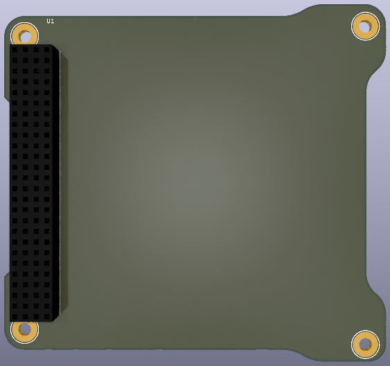

# PC104-Standard-KiCAD #

This repository contains schematics and footprints of the PC/104 standard. 
These designs are compatible with KiCad PCB design software.
The footprints have also a suggested PCB boundary that facilitates the cable management of the CubeSat.

Derived from, although not affiliated with, [pc104.org](https://pc104.org/)

# KiCAD #

The KiCAD's schematic includes all the necessary pins assignments to speedup the payload design. The footprint already has the edge cuts done and it follows the PC104 specification.

